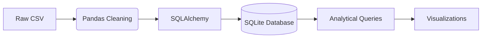

# Olympic Games Historical Data Analysis 🏅

[](https://www.python.org/)
[](https://www.sqlite.org/index.html)

A comprehensive analysis of 120 years of Olympic history data using Python and SQL, featuring database design, data transformation, and analytical insights.


## 📚 Table of Contents
- [Database Design](#-database-design)
- [Data Pipeline](#-data-pipeline)
- [Key Insights](#-key-insights)
- [Installation](#-installation)

## 🗃️ Database Design

### Entity Relationship Diagram (ERD)


### Schema Overview
```sql
-- Athletes Table
CREATE TABLE athletes (
    Ath_ID INTEGER PRIMARY KEY,
    Name VARCHAR(255),
    Sex VARCHAR(1),
    Age INTEGER,
    Height INTEGER,
    Weight INTEGER
);

-- Results Table
CREATE TABLE results (
    Result_ID INTEGER PRIMARY KEY,
    Ath_ID INTEGER REFERENCES athletes(Ath_ID),
    NOC VARCHAR(3) REFERENCES noc_countries(NOC),
    Game_ID INTEGER REFERENCES games(Games_ID),
    Event_ID INTEGER REFERENCES events(Event_ID),
    Medal VARCHAR(255)
);

-- Additional tables: noc_countries, sports, games, events
```

## ⚙️ Data Pipeline

### Data Cleaning & Transformation
1. **Handling Missing Values**:
   ```python
   # Fill missing values with median
   athletes_df['Age'] = athletes_df['Age'].fillna(athletes_df['Age'].median())
   athletes_df['Height'] = athletes_df['Height'].fillna(athletes_df['Height'].median())
   athletes_df['Weight'] = athletes_df['Weight'].fillna(athletes_df['Weight'].median())
   ```

2. **Database Normalization**:
   - Created 6 normalized tables from raw CSV files.
   - Established primary/foreign key relationships.

3. **Data Validation**:
   - Removed duplicate entries.
   - Standardized country codes (NOC).

### ETL Process


## 🔍 Key Insights

### 1. Winter Olympics Medal Leaders


**Query**:
```sql
SELECT c.Region, COUNT(*) AS Gold_Medals
FROM results r
JOIN games g ON r.Game_ID = g.Games_ID
JOIN noc_countries c ON r.NOC = c.NOC
WHERE g.Season = 'Winter' AND r.Medal = 'Gold'
GROUP BY c.Region
ORDER BY Gold_Medals DESC
LIMIT 5;
```

**Top Countries**: Norway (122), United States (96), Germany (87)

---

### 2. Athlete Age Distribution by Sport


**Analysis**:
- **Youngest Athletes**: Gymnastics (avg 24.2 years)
- **Oldest Athletes**: Equestrianism (avg 37.5 years)

---

### 3. All-Time Medal Leaders

**Notable Champions**:
1. Michael Phelps (28 medals)
2. Larisa Latynina (18 medals)
3. Paavo Nurmi (12 medals)

## 🛠️ Installation

### Requirements
```bash
Python 3.8+
pip install 
```

### Libraries
```text
pandas==1.3.5
sqlalchemy==1.4.32
matplotlib==3.5.1
jupyter==1.0.0
```

### Run Analysis
```bash
git clone https://github.com/belalmohsen13/olympic_analysis.git
cd olympic_analysis
jupyter notebook analysis.ipynb
```

---

**Created by [Belal Mohsen]** • [](https://www.linkedin.com/in/belal-mohsen13/)
